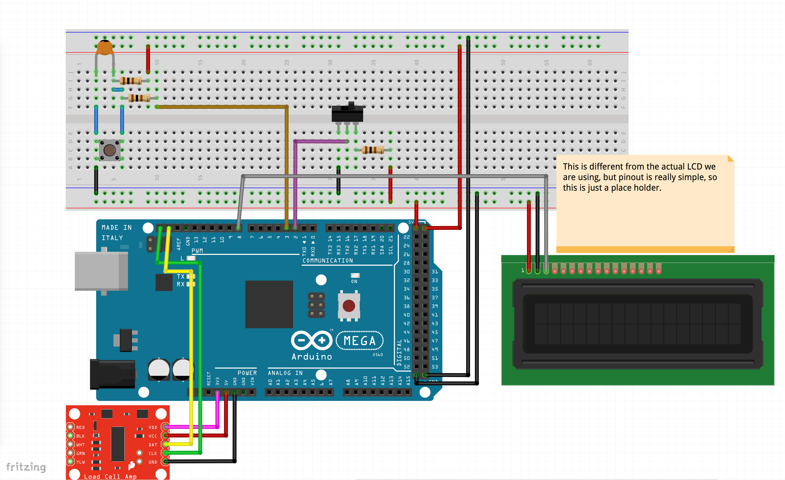

# OXO SNAP LID TESTER

## V1

TOC
#### 1. Setup
#### 2. Wiring Digram
#### 3. Operation
#### 4. Misc
********************************************

1. Setup
Setup:
 * Arduino Mega 2560
 * Adafruit Ethernet Shield (Nice to have)
 * HX711 module
 * SparkFun 20X4 LCD serial display (LCD-09568)
2. Wiring Digram
    
3. Operation
    <table>
        <tr>
            <td width="150"> <b> State </b> </td>
            <td> <b> Message </b> </td>
            <td> <b> Notes </b> </td>
        </tr>
        <tr>
            <td> Startup </td>
            <td> <i> LCD OK </td>
            <td> This is a message you should see during   normal startup. </td>
        </tr>
        <tr>
            <td> Mode selection </td>
            <td> <i> Local/Remote Mode </td>
            <td> This message indicates which mode the fixutre is   running in.
            It can be in local or remote mode and its controlled by the toggle switch.</td>
        </tr>
        <tr>
            <td> Standby mode </td>
            <td> <i>  Ready   0.0 (This would be load cell reading) </td>
            <td> In this mode, fixture will read loadcell values but will not record anything. </td>
        </tr>
        <tr>
            <td> Data capture (i.e. test mode) </td>
            <td> <i>  Ready   0.0   MAX: 11.05 </td>
            <td> This mode is activated for 15 seconds after button is pressed.    If test is
            not perfomed after 15 seconds, fixture will go into standby mode until the button is pressed again.  
            If test is perfomed within 15 seconds, fixture will read data from load cell and when
            test is complete, maximum value obrained will be shown.  
            After button is pressed, a countdown will be shown at the bottom left corder</td>
        </tr>

    </table>
